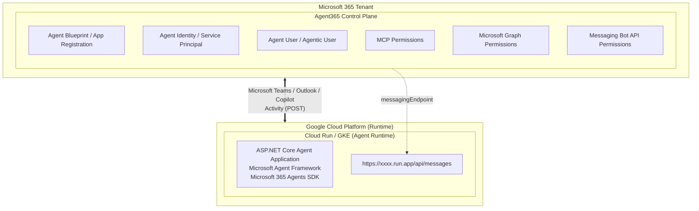
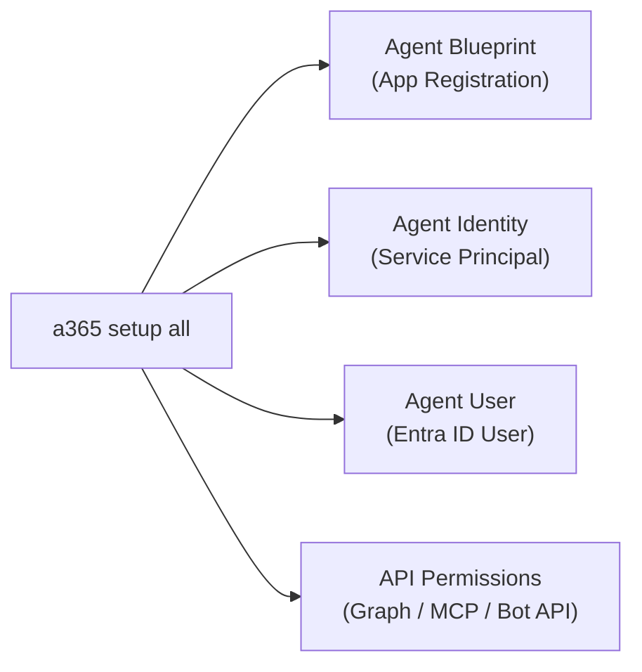
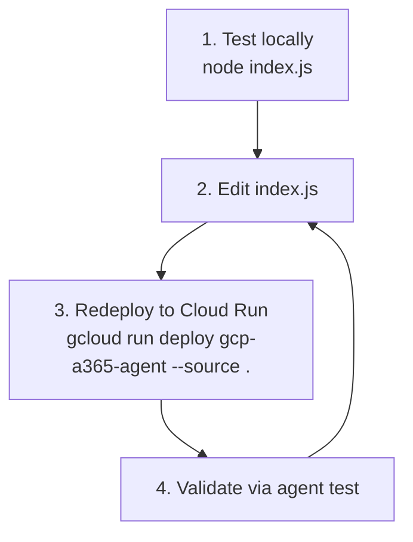

# Introduction

## Running Agent365 Agents on GCP (Cross-Cloud Runtime Architecture)

In the previous article, [Building an Agent with Agent365 CLI](https://zenn.dev/microsoft/articles/a365cli-agentdevelopment-01-en), I walked through publishing an agent with a pro-code approach using Agent365 CLI. In that walkthrough, the actual application runtime was hosted on Azure App Service, fully within the Microsoft platform.

However, as explained in the previous article, Agent365 is not the runtime itself. It works as a control plane built on Microsoft Entra ID. That means the agent application does not have to be hosted on Azure. As long as you can expose a publicly reachable HTTPS `/api/messages` endpoint, you can host the runtime in other cloud environments such as Google Cloud Run or Kubernetes (GKE). The official Agent365 development lifecycle documentation also explicitly states that agent code can be hosted outside Azure:

https://learn.microsoft.com/en-us/microsoft-agent-365/developer/a365-dev-lifecycle

In other words, you can adopt a cross-cloud architecture like this:

- Build only the control plane resources (Agent Identity, Blueprint, and so on) on the Microsoft platform
- Place runtime compute resources on GCP



# Hands-on: Build an Agent on GCP Cloud Run

From here, I will walk through how to deploy an Agent365 agent to Google Cloud Run and make it available from Microsoft Teams.

## Prerequisites

### Azure / Microsoft 365 side

- Access to a **Microsoft Entra tenant** with a role that can create app registrations and Agent Blueprints
- Enrollment in the [Frontier preview program](https://adoption.microsoft.com/copilot/frontier-program/) (required for early access to Microsoft Agent 365)
- At least one **Microsoft 365 license** assignable to an Agent User
- [Azure CLI](https://learn.microsoft.com/en-us/cli/azure/install-azure-cli) installed and signed in
- [Agent 365 CLI](https://learn.microsoft.com/en-us/microsoft-agent-365/developer/agent-365-cli#install-the-agent-365-cli) installed
- [Service Principal creation and permission grant (required for Agent365 CLI to create Agent Blueprint / Agent Identity in Entra ID)](https://zenn.dev/microsoft/articles/a365cli-agentdevelopment-01-en)

### GCP side

- A GCP project already created
- [Cloud Run API](https://docs.cloud.google.com/run/docs) enabled
- [gcloud SDK](https://docs.cloud.google.com/sdk/docs) installed and authenticated

```bash
gcloud auth login
gcloud config set project <GCP_PROJECT_ID>
gcloud config set run/region us-central1   # any region you prefer
```

### Local development environment

- Code editor (Visual Studio Code)
- Node.js 18 or later

## Step 1: Create the project

First, create a Node.js project and install required packages.

```bash
mkdir gcp-a365-agent
cd gcp-a365-agent
npm init -y
npm install express @microsoft/agents-hosting dotenv
```

Each installed package has the following role:

| Package | Role |
|---|---|
| `express` | HTTP server that provides `/api/messages` and health-check endpoints |
| `@microsoft/agents-hosting` | Microsoft 365 Agents SDK for CloudAdapter, JWT validation, and auth config loading |
| `dotenv` | Loads environment variables from `.env` for local development |

Check `scripts.start` in the generated `package.json` and ensure it is set to `node index.js`. Cloud Run Node.js buildpacks use `npm start` to launch your app. If this is not configured correctly, the container will fail to start after deployment.

```json
{
  "name": "gcp-a365-agent",
  "version": "1.0.0",
  "main": "index.js",
  "scripts": {
    "start": "node index.js"
  },
  "type": "commonjs",
  "dependencies": {
    "@microsoft/agents-hosting": "^1.4.2",
    "dotenv": "^17.4.2",
    "express": "^5.2.1"
  }
}
```

:::message
`npm init -y` may generate a `package.json` without a `start` script in some environments. When no `Dockerfile` is present, Cloud Run uses [Google Cloud Buildpacks](https://cloud.google.com/docs/buildpacks/overview) and starts the process with `npm start`. If `"start": "node index.js"` is missing, container startup will fail, so make sure to verify it.
:::

## Step 2: Implement the agent

Create `index.js` in the project root.

```js
// Load environment variables from .env file (for local development)
require('dotenv').config();

const {
  CloudAdapter,
  AgentApplication,
  authorizeJWT,
  loadAuthConfigFromEnv
} = require('@microsoft/agents-hosting');
const express = require('express');

// Load clientId, clientSecret, and tenantId from environment variables.
// These map to your Agent Blueprint App Registration in Entra ID:
//   clientId     = Blueprint Application (client) ID
//   clientSecret = Blueprint client secret value
//   tenantId     = Your Microsoft Entra tenant ID
const authConfig = loadAuthConfigFromEnv();

// Pass authConfig to the adapter so outbound replies can authenticate
const adapter = new CloudAdapter(authConfig);

const agentApplication = new AgentApplication({ adapter });

// Handle incoming messages
agentApplication.onMessage(async (context, next) => {
  await context.sendActivity(`You said: ${context.activity.text}`);
  // await next(); // this can raise an error in this sample flow, so keep it commented out
});

// Handle conversation updates
agentApplication.onConversationUpdate('membersAdded', async (context, next) => {
  for (const member of context.activity.membersAdded) {
    if (member.id !== context.activity.recipient.id) {
      await context.sendActivity('Welcome! This agent is running on GCP.');
    }
  }
  await next();
});

// Required: handle agentLifecycle events sent by Agent 365 platform
// Without this handler, the SDK throws on first conversation initiation
agentApplication.onActivity('agentLifecycle', async (context, next) => {
  await next(); // acknowledge silently - do NOT call sendActivity here
});

const server = express();
server.use(express.json());

// Health check - no auth required
server.get('/', (req, res) => res.status(200).send('GCP Agent is running.'));

// JWT validation applied only to /api/messages
// Bot Framework Service sends a Bearer token signed by botframework.com
// This is required even on GCP because the control plane is still Microsoft
server.post('/api/messages', authorizeJWT(authConfig), (req, res) => {
  adapter.process(req, res, async (context) => {
    await agentApplication.run(context);
  });
});

const port = process.env.PORT || 8080;
server.listen(port, () => console.log(`Agent listening on port ${port}`));
```

### Key points in the code

This is a minimal, single-file implementation, but there are a few important points.

**1. Loading auth configuration**

```js
const authConfig = loadAuthConfigFromEnv();
```

`loadAuthConfigFromEnv()` reads `clientId`, `clientSecret`, and `tenantId` from environment variables. In later steps, you will use outputs from Agent365 CLI plus Entra ID service principal details to create and update your `.env` file.

**2. JWT validation middleware**

```js
server.post('/api/messages', authorizeJWT(authConfig), (req, res) => {
```

`authorizeJWT(authConfig)` is applied to `/api/messages`. The Bot Framework Service created under Agent365 sends a `botframework.com`-signed Bearer token. So even if your runtime is on GCP, **JWT validation is still required**, because the control plane remains on Microsoft.

**3. `agentLifecycle` handler**

```js
agentApplication.onActivity('agentLifecycle', async (context, next) => {
  await next(); // acknowledge silently - do NOT call sendActivity here
});
```

The Agent365 platform sends an `agentLifecycle` event at first conversation start. **If this handler is missing, the SDK throws an error.** Here, you should just acknowledge with `next()` and avoid `sendActivity`.

**4. Health-check endpoint**

```js
server.get('/', (req, res) => res.status(200).send('GCP Agent is running.'));
```

This is used for Cloud Run health checks and simple manual verification. `GET /` returns a status message without authentication.

## Step 3: Deploy to Cloud Run

Use `gcloud run deploy` to build and deploy directly from source.

```bash
gcloud run deploy gcp-a365-agent \
  --source . \
  --region us-central1 \
  --platform managed \
  --allow-unauthenticated
```

:::message
`--allow-unauthenticated` is required to accept HTTP requests from Bot Framework. Authentication is handled in application code through the `authorizeJWT` middleware, not at the Cloud Run access layer.
:::

After deployment, you will get a URL like this:

```
Service URL: https://gcp-a365-agent-XXXX-uc.run.app
```

This URL becomes the base for your Agent365 `messagingEndpoint`. Save it.

## Step 4: Configure a365.config.json

Create `a365.config.json` in the project root. You can also generate it with [a365 config init](https://learn.microsoft.com/en-us/microsoft-agent-365/developer/reference/cli/config#config-init).

```bash
a365 config init
```

For GCP hosting, these two settings are critical:

```json
{
  "tenantId": "<YOUR_TENANT_ID>",
  "subscriptionId": "<YOUR_AZURE_SUBSCRIPTION_ID>",
  "resourceGroup": "<RESOURCE_GROUP_NAME>",
  "location": "japaneast",
  "environment": "prod",

  "messagingEndpoint": "https://gcp-a365-agent-XXXX-uc.run.app/api/messages",
  "needDeployment": false,

  "agentIdentityDisplayName": "MyGcpAgent Identity",
  "agentBlueprintDisplayName": "MyGcpAgent Blueprint",
  "agentUserDisplayName": "MyGcpAgent Agent User",
  "agentUserPrincipalName": "mygcpagent@yourtenant.onmicrosoft.com",
  "agentUserUsageLocation": "US",
  "managerEmail": "admin@yourtenant.onmicrosoft.com",

  "deploymentProjectPath": ".",
  "agentDescription": "GCP-hosted Agent 365 Agent"
}
```

| Setting | Description |
|---|---|
| `messagingEndpoint` | Cloud Run URL with `/api/messages` appended |
| `needDeployment: false` | Instructs CLI to **skip Azure deployment** because hosting is handled externally |
| `deploymentProjectPath` | Output target for `.env` stamping, usually `"."` |

`needDeployment: false` is the key to cross-cloud runtime. With this setting, the CLI skips infrastructure provisioning and runs only control plane setup (Blueprint / Identity / Permissions in Entra ID).

## Step 5: Run Agent365 CLI setup

With Azure CLI already signed in, run:

```bash
az login
a365 setup all
```

Because `needDeployment: false` is set, `--skip-infrastructure` is not required. The CLI automatically skips infra deployment and creates only these resources:



After setup completes, the following are configured automatically:

1. **Agent Blueprint** (Entra ID app registration)
2. **Agent Identity** (service principal)
3. Permission grants and consent for **Microsoft Graph / MCP / Messaging Bot API**
4. **Agent User** (Entra ID user) creation and Microsoft 365 license assignment

The generated `.env` format looks like this:

```
clientId=<AGENT_BLUEPRINT_APP_ID>
clientSecret=<AGENT_BLUEPRINT_CLIENT_SECRET>
tenantId=<YOUR_TENANT_ID>
```

:::message alert
The `.env` file contains client secrets. **Never commit it to Git.** Add `.env` to `.gitignore`.
:::

### Apply environment variables to Cloud Run

You need to set values from `.env` as Cloud Run environment variables.

```bash
gcloud run services update gcp-a365-agent \
  --region us-central1 \
  --set-env-vars "clientId=<AGENT_BLUEPRINT_APP_ID>,clientSecret=<AGENT_BLUEPRINT_CLIENT_SECRET>,tenantId=<YOUR_TENANT_ID>"
```

## Step 6: Publish the agent

Package the manifest and upload it to Microsoft 365 admin portal.

```bash
a365 publish
```

This packages `manifest.json` and `agenticUserTemplateManifest.json` under `manifest/` into a ZIP that can be uploaded to Microsoft 365 Admin Center.

```
manifest/
├── manifest.json                    # Teams App Manifest
├── agenticUserTemplateManifest.json # Agentic User template definition
├── color.png                        # App icon (color)
└── outline.png                      # App icon (outline)
```

In `manifest.json`, verify that the Blueprint ID is set in `id`.

```json
{
  "$schema": "https://developer.microsoft.com/en-us/json-schemas/teams/vdevPreview/MicrosoftTeams.schema.json",
  "id": "<AGENT_BLUEPRINT_ID>",
  "name": {
    "short": "MyGcpAgent Blueprint",
    "full": "MyGcpAgent Blueprint"
  },
  "manifestVersion": "devPreview",
  "agenticUserTemplates": [
    {
      "id": "<TEMPLATE_ID>",
      "file": "agenticUserTemplateManifest.json"
    }
  ]
}
```

In `agenticUserTemplateManifest.json`, `activityProtocol` is set as the communication protocol.

```json
{
  "id": "<TEMPLATE_ID>",
  "schemaVersion": "0.1.0-preview",
  "agentIdentityBlueprintId": "<AGENT_BLUEPRINT_ID>",
  "communicationProtocol": "activityProtocol"
}
```

Upload the generated `manifest.zip` in Microsoft Admin Portal to register the agent.

## Step 7: Register endpoint in Teams Developer Portal

As in the previous article, register the app endpoint that receives agent messages from Teams Developer Portal. First, run:

```bash
a365 config display -g
```


Save the displayed `/api/messages` URL, then open Teams Developer Portal: https://dev.teams.microsoft.com/home. In Tools, choose your Agent Blueprint. Under Configuration, set Agent Type to API Based, paste the saved URL into Notification URL, then save.


## Step 8: Validation

### Verify Cloud Run connectivity

```bash
curl https://gcp-a365-agent-XXXX-uc.run.app/
```

If you receive:

```
GCP Agent is running.
```

your agent is running correctly on Cloud Run.

### Check Cloud Run logs

To verify whether messages are arriving from Bot Framework, check Google Cloud logs:

```bash
gcloud run services logs read gcp-a365-agent \
  --region us-central1 \
  --limit 50
```

### Test as an agent

Depending on your environment, test from one of the following:

- **Agents Playground**: developer test tool for Agent365
- **Microsoft Teams**: if already published
- **Agent Shell**: CLI-based testing

Send a message from Teams and confirm that the echo response `You said: <message>` is returned.

## Development workflow

After setup, your daily development cycle usually looks like this:



#### Local test

```bash
node index.js
# => Agent listening on port 8080
```

```bash
curl http://localhost:8080/
# => GCP Agent is running.
```

#### Redeploy

After code changes, redeploy with:

```bash
gcloud run deploy gcp-a365-agent --source .
```

Because the Cloud Run `messagingEndpoint` URL remains the same, no Agent365-side config update is required after redeploy.

### Troubleshooting

| Symptom | Checkpoints |
|---|---|
| Cannot reach Messaging Endpoint | Ensure endpoint is `https://<cloud-run-url>/api/messages` / Cloud Run allows unauthenticated access / check firewall rules |
| License assignment fails | Assign a Microsoft 365 Frontier license manually, or use a user path that does not require a license |
| `agentLifecycle` errors | Verify `agentApplication.onActivity('agentLifecycle', ...)` is defined. Without it, first conversation initiation fails |
| JWT validation error | Verify `.env` values for `clientId` / `clientSecret` / `tenantId`, and ensure they are applied to Cloud Run environment variables |

:::message
For more detailed troubleshooting, see [Agent 365 Troubleshooting Guide](https://learn.microsoft.com/en-us/microsoft-agent-365/developer/troubleshooting).
:::

## About a365.generated.config.json

When you run `a365 setup all`, `a365.generated.config.json` is automatically generated alongside `a365.config.json`. It records resource IDs and secrets created by the CLI.

```json
{
  "agentBlueprintId": "<BLUEPRINT_ID>",
  "agentBlueprintServicePrincipalObjectId": "<SP_OBJECT_ID>",
  "AgenticAppId": "<AGENTIC_APP_ID>",
  "AgenticUserId": "<AGENTIC_USER_ID>",
  "agentBlueprintClientSecret": "<CLIENT_SECRET>",
  "messagingEndpoint": "https://gcp-a365-agent-XXXX-uc.run.app/api/messages",
  "resourceConsents": [
    {
      "resourceName": "Microsoft Graph",
      "scopes": ["Mail.ReadWrite", "Mail.Send", "Chat.ReadWrite", "User.Read.All", "Sites.Read.All", "Files.ReadWrite.All", "ChannelMessage.Read.All", "ChannelMessage.Send"],
      "inheritablePermissionsConfigured": true
    },
    {
      "resourceName": "Agent 365 Tools",
      "scopes": ["McpServersMetadata.Read.All"],
      "inheritablePermissionsConfigured": true
    },
    {
      "resourceName": "Messaging Bot API",
      "scopes": ["Authorization.ReadWrite", "user_impersonation"],
      "inheritablePermissionsConfigured": true
    }
  ]
}
```

From `resourceConsents`, you can see that three API permission groups are automatically consented for the Agent Blueprint.

| Resource | Main scopes | Purpose |
|---|---|---|
| **Microsoft Graph** | `Mail.ReadWrite`, `Chat.ReadWrite`, `Files.ReadWrite.All`, etc. | Lets the agent access Microsoft 365 data |
| **Agent 365 Tools** | `McpServersMetadata.Read.All` | Reads MCP server metadata |
| **Messaging Bot API** | `Authorization.ReadWrite`, `user_impersonation` | Supports Bot Framework messaging auth |

These are configured with `inheritablePermissionsConfigured: true`, which means they are inheritable by Agent User.

:::message alert
`a365.generated.config.json` also contains client secrets. Add it to `.gitignore` together with `.env`.
:::

## Summary

In this article, I covered an implementation pattern for hosting an Agent365 agent on Google Cloud Run as a cross-cloud runtime architecture.

Key takeaways:

1. **Agent365 is a control plane**: Identity / Blueprint / Permissions are built in Microsoft Entra ID, while runtime compute can live anywhere that exposes an HTTPS endpoint.
2. **`needDeployment: false`**: With this one setting in `a365.config.json`, the CLI skips Azure infrastructure provisioning and builds only the control plane.
3. **JWT validation is mandatory**: Even with runtime on GCP, `authorizeJWT` is required for requests from Bot Framework.

Agent365 is still in Frontier Preview, but this flexible cross-cloud architecture is already a strong benefit for organizations adopting multi-cloud strategies.

## References

- [Build an Agent 365 agent deployed in Google Cloud Platform (GCP)](https://learn.microsoft.com/en-us/microsoft-agent-365/developer/deploy-agent-gcp)
- [Agent 365 Development Lifecycle](https://learn.microsoft.com/en-us/microsoft-agent-365/developer/a365-dev-lifecycle)
- [Agent 365 CLI Documentation](https://learn.microsoft.com/en-us/microsoft-agent-365/developer/agent-365-cli)
- [Agent 365 Troubleshooting Guide](https://learn.microsoft.com/en-us/microsoft-agent-365/developer/troubleshooting)
