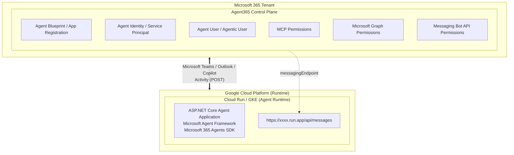
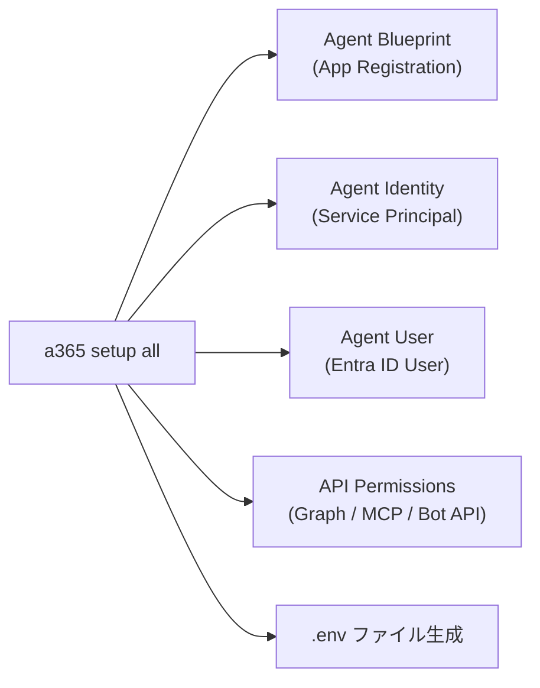
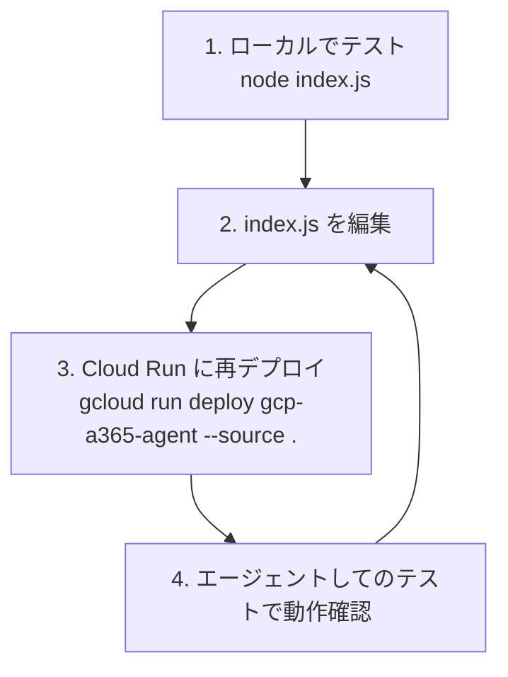

# はじめに

## GCP 上での Agent365 エージェント実行（Cross‑Cloud Runtime 構成）

前章では Azure App Service 上にエージェントをホストする構成について説明しましたが、Agent365 はエージェントの「実行環境（Runtime）」ではなく Microsoft Entra ID を基盤とした「Control Plane」として動作します。

そのため、エージェント本体は Azure 上にホストする必要はなく HTTPS で到達可能な `/api/messages` エンドポイントを公開できる環境であれば、Google Cloud Run や Kubernetes（GKE）など任意のクラウド環境上でホストすることが可能です。Agent365 の Development Lifecycle においても、エージェントコードは Azure 以外のクラウドサービス上でホスト可能であることが以下に明記されています。

https://learn.microsoft.com/en-us/microsoft-agent-365/developer/a365-dev-lifecycle

つまり以下の様に

- Agent Identity や Blueprint などの Control Plane のみを Microsoft Platform 側に構築  
- エージェントの Runtime であるコンピュートリソースを GCP 側に配置  

とする Cross‑Cloud 構成を取ることが可能となります。



# ハンズオン：GCP Cloud Run でのエージェント構築

ここからは、実際に Google Cloud Run 上に Agent365 エージェントをデプロイし、Microsoft Teams から利用できるようになるまでの手順をステップバイステップで解説します。

## 前提条件

### Azure / Microsoft 365 側

- **Microsoft Entra テナント** へのアクセス権（アプリケーション登録と Agent Blueprint 作成が可能なロール）
- [Frontier preview program](https://adoption.microsoft.com/copilot/frontier-program/) への参加（Microsoft Agent 365 の早期アクセスに必要）
- Agent User に割り当て可能な **Microsoft 365 ライセンス** が最低 1 つ
- [Azure CLI](https://learn.microsoft.com/ja-jp/cli/azure/install-azure-cli) のインストールおよびサインイン済み
- [Agent 365 CLI](https://learn.microsoft.com/en-us/microsoft-agent-365/developer/agent-365-cli#install-the-agent-365-cli) のインストール済み
- [Service Principal の作成と権限付与（Agent365 CLI が Entra ID 上に Agent Blueprint / Agent Identity を作成するために必要）～前回記事参照～](https://zenn.dev/microsoft/articles/a365cli-agentdevelopment-01)

### GCP 側

- GCP プロジェクトが作成済み
- [Cloud Run API](https://docs.cloud.google.com/run/docs) が有効化済み
- [gcloud SDK](https://docs.cloud.google.com/sdk/docs) のインストールおよび認証済み

```bash
gcloud auth login
gcloud config set project <GCP_PROJECT_ID>
gcloud config set run/region us-central1   # 任意のリージョン
```

### ローカル開発環境

- コードエディター（Visual Studio Code ）
- Node.js 18 以上

## Step 1：プロジェクトの作成

まず、Node.js プロジェクトを作成し必要なパッケージをインストールします。

```bash
mkdir gcp-a365-agent
cd gcp-a365-agent
npm init -y
npm install express @microsoft/agents-hosting dotenv
```

インストールされるパッケージの役割は以下の通りです。

| パッケージ | 役割 |
|---|---|
| `express` | HTTP サーバー。`/api/messages` エンドポイントと Health Check を提供 |
| `@microsoft/agents-hosting` | Microsoft 365 Agents SDK。CloudAdapter / JWT 検証 / 認証設定のロード |
| `dotenv` | .env ファイルから環境変数をロード（ローカル開発用） |

`npm init -y` で生成された package.json の `scripts.start` を確認し、`node index.js` が設定されていることを確認します。Cloud Run の Node.js ビルドパックは `npm start` を使ってアプリケーションを起動するため、この設定が正しくないとデプロイ後にコンテナが起動しません。

```json
{
  "name": "gcp-a365-agent",
  "version": "1.0.0",
  "main": "index.js",
  "scripts": {
    "start": "node index.js"
  },
  "type": "commonjs",
  "dependencies": {
    "@microsoft/agents-hosting": "^1.4.2",
    "dotenv": "^17.4.2",
    "express": "^5.2.1"
  }
}
```

:::message
`npm init -y` のデフォルトでは `start` スクリプトが未定義の場合があります。Cloud Run は `Dockerfile` がない場合 [Google Cloud Buildpacks](https://cloud.google.com/docs/buildpacks/overview) を使用し、`npm start` でプロセスを起動します。`"start": "node index.js"` が設定されていないとコンテナ起動時に失敗するため、必ず確認してください。
:::


## Step 2：エージェントコードの実装

プロジェクトルートに index.js を作成します。

```js
// Load environment variables from .env file (for local development)
require('dotenv').config();

const { 
  CloudAdapter, 
  AgentApplication, 
  authorizeJWT, 
  loadAuthConfigFromEnv 
} = require('@microsoft/agents-hosting');
const express = require('express');

// Loads clientId, clientSecret, tenantId from environment variables
// These map to your Agent Blueprint App Registration in Entra ID:
//   clientId     = Blueprint Application (client) ID
//   clientSecret = Blueprint client secret value  
//   tenantId     = Your Microsoft Entra tenant ID
const authConfig = loadAuthConfigFromEnv();

// Pass authConfig to adapter so outbound replies can authenticate
const adapter = new CloudAdapter(authConfig);

const agentApplication = new AgentApplication({ adapter });

// Handle incoming messages
agentApplication.onMessage(async (context, next) => {
  await context.sendActivity(`You said: ${context.activity.text}`);
//await next(); これは元々あったものの、ここで必ずエラーが出るのでコメントアウト
});

// Handle conversation updates
agentApplication.onConversationUpdate('membersAdded', async (context, next) => {
  for (const member of context.activity.membersAdded) {
    if (member.id !== context.activity.recipient.id) {
      await context.sendActivity('Welcome! This agent is running on GCP.');
    }
  }
  await next();
});

// Required: handle agentLifecycle events sent by Agent 365 platform
// Without this handler, the SDK throws on first conversation initiation
agentApplication.onActivity('agentLifecycle', async (context, next) => {
  await next(); // acknowledge silently — do NOT call sendActivity here
});

const server = express();
server.use(express.json());

// Health check — no auth required
server.get('/', (req, res) => res.status(200).send('GCP Agent is running.'));

// JWT validation applied only to /api/messages
// Bot Framework Service sends a Bearer token signed by botframework.com
// This is required even on GCP — the control plane is still Microsoft
server.post('/api/messages', authorizeJWT(authConfig), (req, res) => {
  adapter.process(req, res, async (context) => {
    await agentApplication.run(context);
  });
});

const port = process.env.PORT || 8080;
server.listen(port, () => console.log(`Agent listening on port ${port}`));
```

### コードの構成ポイント

このコードは 1 ファイルにすべてが収まるミニマルな構成ですが、いくつか重要なポイントがあります。

**1. 認証設定の読み込み**

```js
const authConfig = loadAuthConfigFromEnv();
```

`loadAuthConfigFromEnv()` は環境変数から `clientId`、`clientSecret`、`tenantId` の 3 つを読み込みます。これらは後続の Step で Agent365 CLI で実行される情報、Entra ID テナント情報から .env ファイルを作成・追記します。

**2. JWT 検証ミドルウェア**

```js
server.post('/api/messages', authorizeJWT(authConfig), (req, res) => {
```

`/api/messages` エンドポイントには `authorizeJWT(authConfig)` ミドルウェアが適用されています。Bot Framework Service は `botframework.com` の署名付き Bearer Token を送信するため、**エージェントが GCP 上にホストされていても JWT 検証は必須**です。Control Plane は常に Microsoft 側にあるためです。

**3. agentLifecycle ハンドラー**

```js
agentApplication.onActivity('agentLifecycle', async (context, next) => {
  await next(); // acknowledge silently — do NOT call sendActivity here
});
```

Agent365 プラットフォームはエージェントの初回会話開始時に `agentLifecycle` イベントを送信します。**このハンドラーが未定義の場合、SDK がエラーをスローします。** ここでは `sendActivity` を呼ばず `next()` のみで応答確認だけを行います。

**4. Health Check エンドポイント**

```js
server.get('/', (req, res) => res.status(200).send('GCP Agent is running.'));
```

Cloud Run のヘルスチェックや手動での疎通確認用です。認証不要で `GET /` にアクセスするとステータスを返却します。

## Step 3：Cloud Run へのデプロイ

`gcloud run deploy` コマンドでソースコードから直接ビルド・デプロイします。

```bash
gcloud run deploy gcp-a365-agent \
  --source . \
  --region us-central1 \
  --platform managed \
  --allow-unauthenticated
```

:::message
`--allow-unauthenticated` を指定しているのは、Bot Framework からの HTTP リクエストを受け付けるためです。認証は Cloud Run のレイヤーではなく、アプリケーションコード内の `authorizeJWT` ミドルウェアで行います。
:::

デプロイ完了後、以下のような URL が表示されます。

```
Service URL: https://gcp-a365-agent-XXXX-uc.run.app
```

この URL が Agent365 の `messagingEndpoint` となります。メモしておいてください。

## Step 4：a365.config.json の構成

プロジェクトルートに a365.config.json を作成します。[a365 config init](https://learn.microsoft.com/en-us/microsoft-agent-365/developer/reference/cli/config#config-init) コマンドでも生成可能です。

```bash
a365 config init
```

GCP ホスティングの場合に重要なのは以下の 2 つの設定です。

```json
{
  "tenantId": "<YOUR_TENANT_ID>",
  "subscriptionId": "<YOUR_AZURE_SUBSCRIPTION_ID>",
  "resourceGroup": "<RESOURCE_GROUP_NAME>",
  "location": "japaneast",
  "environment": "prod",

  "messagingEndpoint": "https://gcp-a365-agent-XXXX-uc.run.app/api/messages",
  "needDeployment": false,

  "agentIdentityDisplayName": "MyGcpAgent Identity",
  "agentBlueprintDisplayName": "MyGcpAgent Blueprint",
  "agentUserDisplayName": "MyGcpAgent Agent User",
  "agentUserPrincipalName": "mygcpagent@yourtenant.onmicrosoft.com",
  "agentUserUsageLocation": "US",
  "managerEmail": "admin@yourtenant.onmicrosoft.com",

  "deploymentProjectPath": ".",
  "agentDescription": "GCP-hosted Agent 365 Agent"
}
```

| 設定項目 | 説明 |
|---|---|
| `messagingEndpoint` | Cloud Run の URL に `/api/messages` を付加したもの |
| `needDeployment: false` | **Azure へのデプロイをスキップ**する指定。CLI に「自分でホスティングしている」ことを伝える |
| `deploymentProjectPath` | .env ファイルのスタンプ（書き出し）先。通常は `"."` |

`needDeployment: false` が Cross-Cloud 構成の要です。この設定により CLI はインフラのプロビジョニングをスキップし、Control Plane（Entra ID 上の Blueprint / Identity / Permissions）の構築のみを実行します。

## Step 5：Agent365 CLI によるセットアップ

Azure CLI にサインインした状態で、以下のコマンドを実行します。

```bash
az login
a365 setup all
```

`needDeployment: false` が設定されているため `--skip-infrastructure` は不要です。CLI は自動的にインフラデプロイをスキップし、以下のリソースのみを作成します。



セットアップ完了後、以下が自動的に行われます。

1. **Agent Blueprint**（Entra ID アプリ登録）が作成される
2. **Agent Identity**（Service Principal）が作成される
3. **Microsoft Graph / MCP / Messaging Bot API** の各種パーミッションが付与・コンセントされる
4. **Agent User**（Entra ID ユーザー）が作成され、Microsoft 365 ライセンスが割り当てられる

コマンド実行後、作成する .env ファイルの内容は以下の形式です。

```
clientId=<AGENT_BLUEPRINT_APP_ID>
clientSecret=<AGENT_BLUEPRINT_CLIENT_SECRET>
tenantId=<YOUR_TENANT_ID>
```

:::message alert
.env ファイルにはクライアントシークレットが含まれます。**絶対に Git リポジトリにコミットしないでください。** `.gitignore` に .env を追加しておくことを強く推奨します。
:::

### Cloud Run への環境変数の反映

.env ファイルの内容を Cloud Run の環境変数として設定する必要があります。

```bash
gcloud run services update gcp-a365-agent \
  --region us-central1 \
```

## Step 6：エージェントの公開

マニフェストをパッケージして Microsoft 365 管理ポータルにアップロードします。

```bash
a365 publish
```

このコマンドにより manifest 配下の manifest.json と agenticUserTemplateManifest.json が ZIP にパッケージされ、Microsoft 365 Admin Center にアップロード可能な状態になります。

```
manifest/
├── manifest.json                    # Teams App Manifest
├── agenticUserTemplateManifest.json # Agentic User テンプレート定義
├── color.png                        # アプリアイコン（カラー）
└── outline.png                      # アプリアイコン（アウトライン）
```

manifest.json の中身を確認すると、Blueprint ID が `id` フィールドに設定されていることがわかります。

```json
{
  "$schema": "https://developer.microsoft.com/en-us/json-schemas/teams/vdevPreview/MicrosoftTeams.schema.json",
  "id": "<AGENT_BLUEPRINT_ID>",
  "name": {
    "short": "MyGcpAgent Blueprint",
    "full": "MyGcpAgent Blueprint"
  },
  "manifestVersion": "devPreview",
  "agenticUserTemplates": [
    {
      "id": "<TEMPLATE_ID>",
      "file": "agenticUserTemplateManifest.json"
    }
  ]
}
```

agenticUserTemplateManifest.json では通信プロトコルとして `activityProtocol` が指定されています。

```json
{
  "id": "<TEMPLATE_ID>",
  "schemaVersion": "0.1.0-preview",
  "agentIdentityBlueprintId": "<AGENT_BLUEPRINT_ID>",
  "communicationProtocol": "activityProtocol"
}
```

## Step 7：動作確認

### Cloud Run の疎通確認

```bash
curl https://gcp-a365-agent-XXXX-uc.run.app/
```

```
GCP Agent is running.
```

が返却されれば、Cloud Run 上のエージェントは正常に起動しています。

### Cloud Run ログの確認

Bot Framework からのメッセージが到着しているかどうかは、Google Cloud のログで確認できます。

```bash
gcloud run services logs read gcp-a365-agent \
  --region us-central1 \
  --limit 50
```

### エージェントしてのテスト

環境に応じて以下のいずれかからテストできます。

- **Agents Playground** — Agent365 の開発者向けテストツール
- **Microsoft Teams** — publish 済みの場合
- **Agent Shell** — CLI ベースのテスト

Teams からメッセージを送信し、`You said: <メッセージ>` というエコーが返ってくれば成功です。

## 開発ワークフロー

セットアップ完了後の日常的な開発サイクルは以下のようになります。



#### ローカルテスト

```bash
node index.js
# => Agent listening on port 8080
```

```bash
curl http://localhost:8080/
# => GCP Agent is running.
```

#### 再デプロイ

コード変更後は以下のコマンドだけで再デプロイ可能です。

```bash
gcloud run deploy gcp-a365-agent --source .
```

Cloud Run 側の `messagingEndpoint` URL は変わらないため、再デプロイ後に Agent365 側の設定変更は不要です。

### トラブルシューティング

| 症状 | 確認ポイント |
|---|---|
| Messaging Endpoint に到達しない | エンドポイントが `https://<cloud-run-url>/api/messages` であること / Cloud Run が未認証アクセスを許可していること / ファイアウォールルールの有無 |
| ライセンス割り当てに失敗する | Microsoft 365 Frontier ライセンスを手動で割り当てるか、ライセンス不要のユーザーパスを利用する |
| `agentLifecycle` 関連のエラー | `agentApplication.onActivity('agentLifecycle', ...)` ハンドラーが定義されていることを確認。このハンドラーがないと初回会話時にエラーが発生する |
| JWT 検証エラー | .env の `clientId` / `clientSecret` / `tenantId` が正しいか確認。Cloud Run の環境変数に反映されているか確認 |

:::message
より詳細なトラブルシューティングについては [Agent 365 Troubleshooting Guide](https://learn.microsoft.com/en-us/microsoft-agent-365/developer/troubleshooting) を参照してください。
:::

## a365.generated.config.json について

`a365 setup all` を実行すると、a365.config.json と並んで a365.generated.config.json が自動生成されます。このファイルには CLI が作成した各種リソースの ID やシークレットが記録されています。

```json
{
  "agentBlueprintId": "<BLUEPRINT_ID>",
  "agentBlueprintServicePrincipalObjectId": "<SP_OBJECT_ID>",
  "AgenticAppId": "<AGENTIC_APP_ID>",
  "AgenticUserId": "<AGENTIC_USER_ID>",
  "agentBlueprintClientSecret": "<CLIENT_SECRET>",
  "messagingEndpoint": "https://gcp-a365-agent-XXXX-uc.run.app/api/messages",
  "resourceConsents": [
    {
      "resourceName": "Microsoft Graph",
      "scopes": ["Mail.ReadWrite", "Mail.Send", "Chat.ReadWrite", "User.Read.All", "Sites.Read.All", "Files.ReadWrite.All", "ChannelMessage.Read.All", "ChannelMessage.Send"],
      "inheritablePermissionsConfigured": true
    },
    {
      "resourceName": "Agent 365 Tools",
      "scopes": ["McpServersMetadata.Read.All"],
      "inheritablePermissionsConfigured": true
    },
    {
      "resourceName": "Messaging Bot API",
      "scopes": ["Authorization.ReadWrite", "user_impersonation"],
      "inheritablePermissionsConfigured": true
    }
  ]
}
```

`resourceConsents` を見ると、Agent Blueprint に対して 3 種類の API パーミッションが自動的にコンセントされていることがわかります。

| リソース | 主なスコープ | 用途 |
|---|---|---|
| **Microsoft Graph** | `Mail.ReadWrite`, `Chat.ReadWrite`, `Files.ReadWrite.All` 等 | エージェントが Microsoft 365 のデータにアクセスするため |
| **Agent 365 Tools** | `McpServersMetadata.Read.All` | MCP サーバーのメタデータを読み取るため |
| **Messaging Bot API** | `Authorization.ReadWrite`, `user_impersonation` | Bot Framework 経由のメッセージング認証 |

これらは `inheritablePermissionsConfigured: true` となっており、Agent User に継承可能な形で構成されています。

:::message alert
a365.generated.config.json にもクライアントシークレットが含まれます。.env と同様に `.gitignore` に追加してください。
:::

## まとめ

本記事では、Agent365 のエージェントを Google Cloud Run 上にホストする Cross-Cloud 構成の実装手順を解説しました。

ポイントを改めて整理すると、

1. **Agent365 は Control Plane である** — エージェントの Identity / Blueprint / Permissions は Microsoft Entra ID 上に構築するが、Runtime（コンピュートリソース）は HTTPS エンドポイントさえ公開できればどこでもよい
2. **`needDeployment: false`** — a365.config.json でこの 1 行を設定するだけで、CLI は Azure インフラのプロビジョニングをスキップし Control Plane のみを構築する
3. **JWT 検証は必須** — Runtime が GCP 上にあっても、Bot Framework からのリクエストに対する `authorizeJWT` は必要

Agent365 はまだ Frontier Preview の段階ですが、このようにクラウドを横断した柔軟な構成が取れることは、マルチクラウド戦略を採用している組織にとって大きなメリットとなるでしょう。

## 参考リンク

- [Build an Agent 365 agent deployed in Google Cloud Platform (GCP)](https://learn.microsoft.com/en-us/microsoft-agent-365/developer/deploy-agent-gcp)
- [Agent 365 Development Lifecycle](https://learn.microsoft.com/en-us/microsoft-agent-365/developer/a365-dev-lifecycle)
- [Agent 365 CLI Reference](https://learn.microsoft.com/en-us/microsoft-agent-365/developer/agent-365-cli)
- [Agent 365 Troubleshooting Guide](https://learn.microsoft.com/en-us/microsoft-agent-365/developer/troubleshooting)