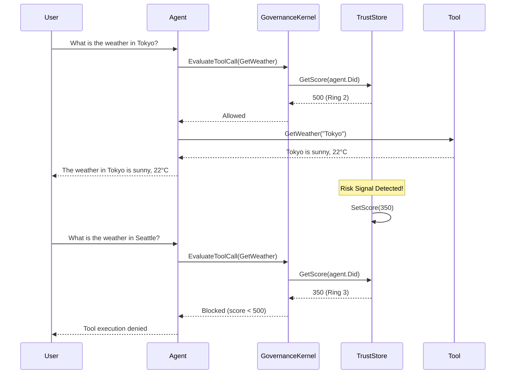

## はじめに

前回の記事では、[Agent Governance Toolkit (AGT)](https://zenn.dev/microsoft/articles/agent-governance-toolkit-policy-01) の Policy 機能を使ったツール呼び出しの制御について解説しました。今回は AGT のもう一つの重要な機能である **Agent Trust（エージェント信頼性管理）** について、実装例を交えて解説します。

AI エージェントが自律的にツールを実行する環境では、「このエージェントは信頼できるか？」という判断が重要になります。Agent Trust は、エージェントに一意の識別子（DID）を付与し、信頼スコアに基づいてアクセス制御を行う仕組みを提供します。

## Agent Trust とは

Agent Trust は以下の機能を提供します：

1. **Agent Identity（エージェント識別）**: エージェントに DID（Decentralized Identifier）を付与し、一意に識別
2. **Trust Score（信頼スコア）**: エージェントの行動履歴に基づいて 0-1000 のスコアを管理
3. **Ring-based Access Control**: 信頼スコアに基づいた段階的なアクセス制御

### Trust Score と Ring レベル

| Ring レベル | スコア範囲 | 説明 |
|------------|-----------|------|
| Ring 0 | 900+ | Verified Partner - フルアクセス |
| Ring 1 | 700-899 | Trusted - 標準操作が可能 |
| Ring 2 | 500-699 | Standard - 制限付き操作 |
| Ring 3 | 0-499 | Restricted - 承認が必要 |

## サンプルプロジェクトの構成

本記事では2つのサンプルプロジェクトを紹介します：

| プロジェクト | 説明 |
|-------------|------|
| AGTIdentityApp01 | Agent Identity の基本的な使い方 |
| AGTIdentityWithMAFApp02 | MAF（Microsoft AI Framework）との統合と信頼スコアベースのアクセス制御 |

サンプルコードは以下のリポジトリで公開しています：
https://github.com/normalian/MyAGTSamples

## サンプル1: Agent Identity の基本（AGTIdentityApp01）

### プロジェクト構成

```xml
<Project Sdk="Microsoft.NET.Sdk">
  <PropertyGroup>
    <OutputType>Exe</OutputType>
    <TargetFramework>net9.0</TargetFramework>
    <ImplicitUsings>enable</ImplicitUsings>
    <Nullable>enable</Nullable>
  </PropertyGroup>

  <ItemGroup>
    <PackageReference Include="Microsoft.AgentGovernance" Version="3.5.0" />
  </ItemGroup>
</Project>
```

### Agent Identity の作成と Trust Score の取得

```csharp
using AgentGovernance.Trust;

var agentIdentity = AgentIdentity.Create(
    name: "DataProcessor",
    sponsor: "alice@company.com",
    capabilities: ["read:data", "write:reports"],
    organization: "Analytics"
);

Console.WriteLine(agentIdentity.Did);                                   // did:mesh:a1b2c3d4e5f6...
Console.WriteLine(Convert.ToBase64String(agentIdentity.PublicKey));     // Base64-encoded public key
Console.WriteLine(agentIdentity.Status);                                // "Active"

// Check the agent's trust score (0-1000, higher = safer)
var trustStore = new FileTrustStore("trust-scores.json");
var score = trustStore.GetScore(agentIdentity.Did);

Console.WriteLine(score);                                       // 500 (default starting score)

// Determine risk level based on score
var riskLevel = score switch{
    >= 700 => "Low", >= 400 => "Medium", _ => "High"
};
Console.WriteLine(riskLevel);                                   // "Medium"
```

### 実行結果

```
did:mesh:xxxxxxxx-xxxx-xxxx-xxxx-xxxxxxxxxxxx
AQAB...（Base64エンコードされた公開鍵）
Active
500
Medium
```

### 解説

- **AgentIdentity.Create()**: エージェントの識別情報を作成します
  - `name`: エージェント名
  - `sponsor`: 責任者のメールアドレス
  - `capabilities`: エージェントが持つ権限のリスト
  - `organization`: 所属組織
- **FileTrustStore**: 信頼スコアをJSONファイルで永続化するストア
- デフォルトの信頼スコアは **500**（Ring 2 - Standard）から開始

## サンプル2: MAF 統合と信頼スコアベースのアクセス制御（AGTIdentityWithMAFApp02）

より実践的なサンプルとして、Microsoft AI Framework（MAF）と AGT を統合し、信頼スコアに基づいてツール実行を制御する例を紹介します。

### プロジェクト構成

```xml
<Project Sdk="Microsoft.NET.Sdk">
  <PropertyGroup>
    <OutputType>Exe</OutputType>
    <TargetFramework>net9.0</TargetFramework>
    <ImplicitUsings>enable</ImplicitUsings>
    <Nullable>enable</Nullable>
  </PropertyGroup>

  <ItemGroup>
    <PackageReference Include="Azure.AI.OpenAI" Version="2.9.0-beta.1" />
    <PackageReference Include="Azure.Identity" Version="1.21.0" />
    <PackageReference Include="Microsoft.AgentGovernance" Version="3.5.0" />
    <PackageReference Include="Microsoft.AgentGovernance.Extensions.Microsoft.Agents" Version="3.5.0" />
    <PackageReference Include="Microsoft.Agents.AI" Version="1.5.0" />
    <PackageReference Include="Microsoft.Agents.AI.OpenAI" Version="1.5.0" />
  </ItemGroup>

  <ItemGroup>
    <None Update="policies\trust-based.yaml">
      <CopyToOutputDirectory>Always</CopyToOutputDirectory>
    </None>
  </ItemGroup>
</Project>
```

### 信頼スコアベースのポリシー（trust-based.yaml）

```yaml
version: "1.0"
name: trust-based-access-control
description: "Trust score based tool access control policy"
default_action: allow

terms:
  - name: "trust-terms"
    version: "1.0"
    accepted: true

rules:
  - name: allow-weather-tools
    description: "Allow weather and time tools for agents with sufficient trust"
    condition: "tool_name in ['GetWeather', 'GetTime']"
    action: allow

  - name: block-untrusted-agents
    description: "Block tool calls from agents with trust score below threshold"
    condition: "trust_score < 500"
    action: deny
    message: "Agent trust score is below the required threshold (500)"
```

### メインプログラム（Program.cs）

```csharp
using AgentGovernance.Extensions.Microsoft.Agents;
using AgentGovernance.Trust;
using Azure.AI.OpenAI;
using Azure.Identity;
using Microsoft.Agents.AI;
using Microsoft.Extensions.AI;
using System.ComponentModel;
using System.Text.Json;

namespace AGTIdentityWithMAFApp02;

class Program
{
    // Trust score threshold for tool access (Ring 2)
    private const double TrustScoreThreshold = 500.0;

    // Penalty applied after first execution (simulating a risk signal)
    private const double TrustPenalty = 150.0;

    // Shared trust store instance
    private static FileTrustStore? _trustStore;
    private static string? _agentDid;

    [Description("Get weather information for a location.")]
    static string GetWeather([Description("Target city name")] string city)
    {
        // Check trust score before executing the tool
        if (_trustStore != null && _agentDid != null)
        {
            var currentScore = _trustStore.GetScore(_agentDid);
            Console.WriteLine($"  [Trust Check in Tool] Score: {currentScore:F0}, Threshold: {TrustScoreThreshold}");

            if (currentScore < TrustScoreThreshold)
            {
                return $"[BLOCKED] Tool execution denied. Trust score ({currentScore:F0}) is below threshold ({TrustScoreThreshold}).";
            }
        }

        return $"{city} is sunny, 22°C";
    }

    [Description("Get current time for a timezone.")]
    static string GetTime([Description("Timezone name")] string timezone)
    {
        // Check trust score before executing the tool
        if (_trustStore != null && _agentDid != null)
        {
            var currentScore = _trustStore.GetScore(_agentDid);
            Console.WriteLine($"  [Trust Check in Tool] Score: {currentScore:F0}, Threshold: {TrustScoreThreshold}");

            if (currentScore < TrustScoreThreshold)
            {
                return $"[BLOCKED] Tool execution denied. Trust score ({currentScore:F0}) is below threshold ({TrustScoreThreshold}).";
            }
        }

        return $"Current time in {timezone}: {DateTime.UtcNow:HH:mm:ss} UTC";
    }

    static async Task Main(string[] args)
    {
        var endpoint = Environment.GetEnvironmentVariable("AZURE_OPENAI_ENDPOINT")
            ?? throw new InvalidOperationException("AZURE_OPENAI_ENDPOINT is not set.");
        var deploymentName = Environment.GetEnvironmentVariable("AZURE_OPENAI_DEPLOYMENT_NAME")
            ?? "gpt-4.1-mini";

        // 1. Create Agent Identity with Trust Score
        Console.WriteLine("=== Creating Agent Identity ===");

        var agent = AgentIdentity.Create(
            name: "WeatherAgent",
            sponsor: "alice@company.com",
            capabilities: ["read:weather", "read:time"],
            organization: "Analytics"
        );

        _agentDid = agent.Did;

        Console.WriteLine($"Agent DID: {agent.Did}");
        Console.WriteLine($"Agent Status: {agent.Status}");
        Console.WriteLine($"Sponsor: {agent.SponsorEmail}");
        Console.WriteLine($"Capabilities: {string.Join(", ", agent.Capabilities)}");

        // 2. Initialize Trust Store with default score (500)
        var trustStorePath = "trust-scores.json";

        if (File.Exists(trustStorePath))
        {
            File.Delete(trustStorePath);
        }

        _trustStore = new FileTrustStore(trustStorePath, defaultScore: 500);

        var initialScore = _trustStore.GetScore(agent.Did);
        Console.WriteLine($"\nInitial Trust Score: {initialScore}");
        Console.WriteLine($"Trust Level: {GetTrustLevel(initialScore)}");

        // 3. Setup Governance Kernel
        var kernel = new GovernanceKernel(new GovernanceOptions
        {
            PolicyPaths = ["policies/trust-based.yaml"],
            EnablePromptInjectionDetection = true,
        });

        kernel.OnAllEvents(evt =>
        {
            Console.WriteLine($"[Governance] Type: {evt.Type}, Tool: {evt.PolicyName}, Agent: {evt.AgentId}");
        });

        // 4. Create MAF Agent with Governance
        var chatClient = new AzureOpenAIClient(new Uri(endpoint), new AzureCliCredential())
            .GetChatClient(deploymentName)
            .AsIChatClient();

        AIAgent CreateAgent()
        {
            return chatClient
                .AsAIAgent(
                    name: agent.Name,
                    instructions: "You are a helpful assistant that provides weather and time information.",
                    tools:
                    [
                        AIFunctionFactory.Create(GetWeather, name: "GetWeather"),
                        AIFunctionFactory.Create(GetTime, name: "GetTime")
                    ]
                )
                .WithGovernance(
                    kernel,
                    new AgentFrameworkGovernanceOptions
                    {
                        DefaultAgentId = agent.Did,
                        EnableFunctionMiddleware = true,
                        BlockedToolResultFactory = toolResult =>
                        {
                            Console.WriteLine($"[BLOCKED by Policy] {toolResult.AuditEntry.PolicyName}: {toolResult.Reason}");
                            return $"Tool call blocked by governance policy.";
                        }
                    });
        }

        // 5. First Execution (Score = 500, should PASS)
        Console.WriteLine("\n=== FIRST EXECUTION (Trust Score >= 500) ===");
        var currentScore = _trustStore.GetScore(agent.Did);
        Console.WriteLine($"Current Trust Score: {currentScore:F0}");
        Console.WriteLine($"Expected Result: ALLOWED");

        var aiAgent1 = CreateAgent();
        var response1 = await aiAgent1.RunAsync("What is the weather in Tokyo?");
        PrintResponse(response1);

        // 6. Apply Trust Penalty (Simulating Risk Signal)
        Console.WriteLine("\n=== APPLYING TRUST PENALTY ===");
        var scoreBefore = _trustStore.GetScore(agent.Did);
        Console.WriteLine($"Score Before Penalty: {scoreBefore:F0}");
        Console.WriteLine($"Applying Penalty: -{TrustPenalty} (Reason: Unusual data access pattern detected)");

        var newScore = scoreBefore - TrustPenalty;
        _trustStore.SetScore(agent.Did, newScore);

        var scoreAfter = _trustStore.GetScore(agent.Did);
        Console.WriteLine($"Score After Penalty: {scoreAfter:F0}");
        Console.WriteLine($"Trust Level: {GetTrustLevel(scoreAfter)}");

        // 7. Second Execution (Score < 500, should BLOCK)
        Console.WriteLine("\n=== SECOND EXECUTION (Trust Score < 500) ===");
        currentScore = _trustStore.GetScore(agent.Did);
        Console.WriteLine($"Current Trust Score: {currentScore:F0}");
        Console.WriteLine($"Expected Result: BLOCKED");

        var aiAgent2 = CreateAgent();
        var response2 = await aiAgent2.RunAsync("What is the weather in Seattle?");
        PrintResponse(response2);

        // 8. Summary
        Console.WriteLine("\n=== SUMMARY ===");
        Console.WriteLine($"Agent DID: {agent.Did}");
        Console.WriteLine($"Initial Score: 500 (Ring 2 - Standard)");
        Console.WriteLine($"Penalty Applied: -{TrustPenalty}");
        Console.WriteLine($"Final Score: {_trustStore.GetScore(agent.Did):F0} (Ring 3 - Restricted)");
        Console.WriteLine($"First Call: ALLOWED");
        Console.WriteLine($"Second Call: BLOCKED");
    }

    static string GetTrustLevel(double score) => score switch
    {
        >= 900 => "Ring 0 - Verified Partner (Full Access)",
        >= 700 => "Ring 1 - Trusted (Standard Operations)",
        >= 500 => "Ring 2 - Standard (Limited Operations)",
        _ => "Ring 3 - Restricted (Requires Approval)"
    };

    static void PrintResponse(AgentResponse response)
    {
        foreach (var message in response.Messages)
        {
            Console.WriteLine($"  Role: {message.Role}");
            foreach (var content in message.Contents)
            {
                var contentText = content switch
                {
                    TextContent tc => $"    Text: {tc.Text}",
                    FunctionCallContent fc => $"    FunctionCall: {fc.Name}({JsonSerializer.Serialize(fc.Arguments)})",
                    FunctionResultContent fr => $"    FunctionResult: {fr.CallId} = {fr.Result}",
                    _ => $"    {content.GetType().Name}: {content}"
                };
                Console.WriteLine(contentText);
            }
        }
    }
}
```

### 実行結果

```
=== Creating Agent Identity ===
Agent DID: did:mesh:5298f8ef5a403a261654d3e944226946
Agent Status: Active
Sponsor: alice@company.com
Capabilities: read:weather, read:time

Initial Trust Score: 500
Trust Level: Ring 2 - Standard (Limited Operations)

==================================================
=== FIRST EXECUTION (Trust Score >= 500) ===
==================================================
Current Trust Score: 500
Trust Level: Ring 2 - Standard (Limited Operations)
Expected Result: ALLOWED (score >= 500)

[Governance] Type: PolicyCheck, Tool: , Agent: did:agentmesh:weatheragent
[Governance] Type: PolicyCheck, Tool: , Agent: did:agentmesh:weatheragent
  [Trust Check in Tool] Score: 500, Threshold: 500

Agent Response 1:
  Role: assistant
    FunctionCall: GetWeather({"city":"Tokyo"})
  Role: tool
    FunctionResult: call_9mQLzDnLFrAf3KlWSfS4tGUc = Tokyo is sunny, 22°C
  Role: assistant
    Text: The weather in Tokyo is sunny with a temperature of 22°C.

==================================================
=== APPLYING TRUST PENALTY (Risk Signal) ===
==================================================
Score Before Penalty: 500
Applying Penalty: -150 (Reason: Unusual data access pattern detected)
Score After Penalty: 350
Trust Level: Ring 3 - Restricted (Requires Approval)

==================================================
=== SECOND EXECUTION (Trust Score < 500) ===
==================================================
Current Trust Score: 350
Trust Level: Ring 3 - Restricted (Requires Approval)
Expected Result: BLOCKED (score < 500)

[Governance] Type: PolicyCheck, Tool: , Agent: did:agentmesh:weatheragent
[Governance] Type: PolicyCheck, Tool: , Agent: did:agentmesh:weatheragent
  [Trust Check in Tool] Score: 350, Threshold: 500

Agent Response 2:
  Role: assistant
    FunctionCall: GetWeather({"city":"Seattle"})
  Role: tool
    FunctionResult: call_2ozJf1mqgNYAd6TOUSMvel4C = [BLOCKED] Tool execution denied. Trust score (350) is below threshold (500).
  Role: assistant
    Text: I am currently unable to fetch live weather data for Seattle. However, you can check the weather in Seattle by visiting a weather website or using a weather app. Is there anything else I can help you with?

==================================================
=== SUMMARY ===
==================================================
Agent DID: did:mesh:5298f8ef5a403a261654d3e944226946
Initial Score: 500 (Standard - Ring 2)
Penalty Applied: -150
Final Score: 350 (Restricted - Ring 3)
First Call: ALLOWED (score >= 500)
Second Call: BLOCKED (score < 500)
```

## 動作の流れ



## 実装のポイント

### 1. Agent Identity の作成

```csharp
var agent = AgentIdentity.Create(
    name: "WeatherAgent",
    sponsor: "alice@company.com",
    capabilities: ["read:weather", "read:time"],
    organization: "Analytics"
);
```

- `sponsor`: エージェントの責任者を明確にすることで、問題発生時の連絡先を特定可能
- `capabilities`: エージェントが持つべき権限を明示的に宣言

### 2. Trust Store の永続化

```csharp
var trustStore = new FileTrustStore("trust-scores.json", defaultScore: 500);
```

- 信頼スコアは JSON ファイルで永続化
- アプリケーション再起動後もスコアが維持される
- 本番環境では Redis や Cosmos DB などの分散ストアを使用することも可能

### 3. Governance Kernel との統合

```csharp
.WithGovernance(
    kernel,
    new AgentFrameworkGovernanceOptions
    {
        DefaultAgentId = agent.Did,
        EnableFunctionMiddleware = true,
        BlockedToolResultFactory = toolResult =>
        {
            Console.WriteLine($"[BLOCKED] {toolResult.Reason}");
            return $"Tool call blocked by governance policy.";
        }
    });
```

- `DefaultAgentId`: エージェントの DID を設定
- `EnableFunctionMiddleware`: ツール呼び出し前にポリシーチェックを実行
- `BlockedToolResultFactory`: ブロック時のカスタムレスポンスを定義

## 実運用での活用シナリオ

### シナリオ1: 段階的な権限昇格

```csharp
// 新規エージェントは Ring 3 から開始
var newAgent = AgentIdentity.Create(...);
trustStore.SetScore(newAgent.Did, 300);  // Ring 3

// 一定期間の正常動作後、Ring 2 に昇格
if (agentBehaviorNormal)
{
    trustStore.SetScore(newAgent.Did, 500);  // Ring 2
}
```

### シナリオ2: 異常検知時の即座の権限降格

```csharp
// 異常なアクセスパターンを検知
if (DetectAnomalousAccess(agent.Did))
{
    var currentScore = trustStore.GetScore(agent.Did);
    trustStore.SetScore(agent.Did, currentScore - 200);  // 即座に降格

    // 管理者に通知
    NotifyAdmin($"Agent {agent.Did} trust score reduced due to anomaly");
}
```

### シナリオ3: Ring レベルに基づくツールアクセス制御

```yaml
rules:
  - name: ring0-full-access
    condition: "trust_score >= 900"
    action: allow

  - name: ring1-standard-access
    condition: "trust_score >= 700 and tool_name not in ['admin_delete', 'system_config']"
    action: allow

  - name: ring2-limited-access
    condition: "trust_score >= 500 and tool_name in ['read_data', 'get_weather']"
    action: allow

  - name: ring3-restricted
    condition: "trust_score < 500"
    action: deny
    message: "Agent requires approval for this operation"
```

## まとめ

Agent Governance Toolkit の Agent Trust 機能を使うことで：

1. **エージェントの一意識別**: DID によりエージェントを追跡可能
2. **動的な信頼管理**: 行動に基づいて信頼スコアを調整
3. **段階的なアクセス制御**: Ring レベルに基づいた柔軟な権限管理
4. **MAF との統合**: Microsoft AI Framework とシームレスに連携

AI エージェントが自律的に動作する環境では、「信頼できるエージェントにのみ重要な操作を許可する」という考え方が重要です。Agent Trust を活用することで、安全かつ柔軟なエージェントガバナンスを実現できます。

## 参考リンク

- [Agent Governance Toolkit - GitHub](https://github.com/microsoft/agent-governance-toolkit)
- [前回の記事: Agent Governance Toolkit の Policy 機能](https://zenn.dev/microsoft/articles/agent-governance-toolkit-policy-01)
- [サンプルコードリポジトリ](https://github.com/normalian/MyAGTSamples)
