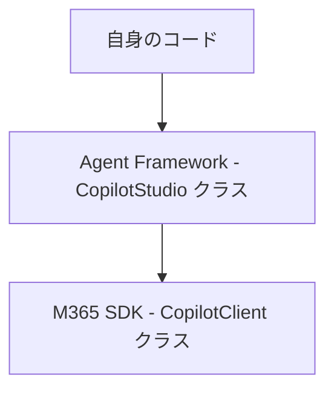

## はじめに

Agent Framework のリポジトリを眺めていたら、以下の CopilotStudio のクラスを発見しました。どうやら Copilot Studio で作成したカスタムエージェントを C#/Python から呼べる様にみえます。今回はこちらをの中身を確認し、実際に疎通を取るまでの手順を紹介したいと思います。
https://github.com/microsoft/agent-framework/tree/main/dotnet/src/Microsoft.Agents.AI.CopilotStudio

しかし、結論としてはタイトルにも有る様に以下のエラーが返されて疎通が取れないという結果になりました。

```js

System.Net.Http.HttpRequestException: 'Error sending request: MethodNotAllowed. Feature ThirdPartyAuthenticatedPublishedBotController.EnableS2SAuthFeature (Feature) not enabled.'

```

M365 Copilot や ChatGPT にも聞いて対策がないか確認してみたのですが、どうやら現時点では上記の機能である EnableS2SAuthFeature を有効化するには support リクエストを作成してお願いするしかなさそうです。
https://community.powerplatform.com/forums/thread/details/?threadid=1410e204-94b4-f011-bbd3-00224826fe9a
https://github.com/microsoft/Agents-for-python/issues/67#issuecomment-3134104191

有効化にはちょっと時間がかかりそうですし、他にも同じエラーに遭遇する人もいると思いますので、今回はこのエラーが出るところまで何をやったかを紹介したいと思います。


## Agent Framework の Copilot Studio クラス

Agent Framework の CopilotStudio クラスをどの様に利用できるかを確認します。まず重要な点として、Agent Framework の CopilotStudio クラスは以下の Microsoft 365 Agents SDK を利用してます。Microsoft 365 Agents SDK とは M365 Teams や Webchat 等、自身で作成したエージェント（古くは Bot と呼んでました）を利用する先をチャンネルとして複数提供するためのライブラリになります。
https://github.com/microsoft/Agents-for-net/tree/main

Agent Framework の CopilotStudio クラス、Microsoft 365 Agents SDK の動作イメージとしては以下の様に



という流れになります。

つまり M365 Agent SDK の CopilotClient クラスを設定しないと Agent Framework 側では利用できないということです。どの様に設定するのかなと思っていたら、以下のページに設定手順の記載がありました。
https://www.nuget.org/packages/microsoft.agents.copilotstudio.client/

主に以下二つの設定が必要になります。Entra ID 側でのアプリケーション登録と権限設定、Copilot Studio 側でのカスタムエージェントを作成・公開しての構成情報取得という流れです。

- Entra ID 側に app registration を新規に作成し、CopilotStudio.Copilot.Invoke API Application Permission を割り当てる
- CopilotStudio 側でカスタムエージェントを作成し、publish して公開利用可能にする


## Entra ID 側に app registration を新規に作成して CopilotStudio.Copilot.Invoke API Application Permission を割り当て

まず Entra ID 側での設定ですが、作成したサービスプリンシパルのメニューから以下を行います。

- API Permissions を選択する
- Add Permission を選択する
- サイドパネルが現れるので、API's my organization uses タブを選択する
- "Power Platform API" と検索（もし表示されない場合は以下の手順を行ってください）
- アプリケーションのパーミッションとしては "Application Permissions" を選んでください  
- パーミッションリストから CopilotStudio を選び CopilotStudio.Copilots.Invoke にチェックする  
- Grant admin consentを実行する

上記のステップを行う際、APIs my organization uses タブで Power Platform API を検索しても見つからない場合、以下の記事を参照してください。

https://learn.microsoft.com/en-us/power-platform/admin/programmability-authentication-v2?tabs=azcli#step-2-configure-api-permissions

以下のコマンドを実行する必要があります。どうやらデフォルトでは有効化されていないようなので、コマンド実行が必要になります。

```bash
az login

az ad sp create --id 8578e004-a5c6-46e7-913e-12f58912df43
```

以下の様な画面になれば設定完了です。パーミッション割り当て後に Grant admin consent for "your-tenant" ボタンを押すのを忘れない様にしてください。

 


## CopilotStudio 側でカスタムエージェントを作成し、publish して公開利用可能にする

次に Copilot Studio 側に移動して自身のカスタムエージェントを作成します。作成後、Settings -> Advanced の画面から Metadata のタブを広げて以下の Environment ID, Tenant ID, Schema name を取得します。

 

上記のカスタムエージェントの Publish を忘れない様にしてください。


## アプリケーションの実行

ここまで来たら後はアプリケーションを実行するだけです。以下のソースコードを実行します。

```csharp

// See https://aka.ms/new-console-template for more information
using Microsoft.Agents.CopilotStudio.Client;
using Microsoft.Extensions.DependencyInjection;
using Microsoft.Extensions.Logging;
using Microsoft.Identity.Client;

class Program
{
    static async Task Main(string[] args)
    {
        // Copilot Studio Agent の設定
        var connectionSettings = new ConnectionSettings
        {
            EnvironmentId = "your-environment-id",   // Copilot Studio の環境 ID
            SchemaName = "your-schema-name"    // エージェントのスキーマ名
        };

        // Azure AD アプリケーションの設定
        string tenantId = "your-tenant-id";
        string clientId = "your-clientid";
        string clientSecret = "your-client-secret-value"; // サービスプリンシパルのシークレット
        string[] scopes = new[] { "https://api.powerplatform.com/.default" };
        // CopilotStudio.Copilots.Invoke は Power Platform API に含まれる

        // MSAL Confidential Client を利用してトークン取得
        var app = ConfidentialClientApplicationBuilder.Create(clientId)
            .WithClientSecret(clientSecret)
            .WithAuthority($"https://login.microsoftonline.com/{tenantId}")
            .Build();

        async Task<string> GetTokenAsync(string resource)
        {
            var result = await app.AcquireTokenForClient(scopes).ExecuteAsync();
            return result.AccessToken;
        }

        // DI コンテナ構築
        var services = new ServiceCollection();
        services.AddHttpClient("mcs");
        services.AddLogging(builder => builder.AddConsole());
        var provider = services.BuildServiceProvider();
        var httpClientFactory = provider.GetRequiredService<IHttpClientFactory>();
        var logger = provider.GetRequiredService<ILogger<Program>>();

        // CopilotClient インスタンス生成
        var copilotClient = new CopilotClient(connectionSettings, httpClientFactory, GetTokenAsync, logger, "mcs");

        // 会話開始
        Console.WriteLine("Copilot Studio エージェントとの会話を開始します...");
        await foreach (var activity in copilotClient.StartConversationAsync(emitStartConversationEvent: true, cancellationToken: CancellationToken.None))
        {
            Console.WriteLine($"[Agent]: {activity.Text}");
        }
        Console.WriteLine("Conversation has been ended.");
    }
}

```

が、最初に記載した通りにポータルで機能が有効化されていないという理由でエラーとなりました。

 

この機能の有効化にはサポートリクエストをあげるのが必須な様です。対応には時間がかかっている様なので、今回はここまでで（汗。現時点はこんなものだという理解＆同じところでハマる人を減らすという意味でお役に立てば幸いです。

## Reference
- https://www.nuget.org/packages/microsoft.agents.copilotstudio.client/
- https://community.powerplatform.com/forums/thread/details/?threadid=1410e204-94b4-f011-bbd3-00224826fe9a
- https://github.com/microsoft/Agents-for-python/issues/67#issuecomment-3134104191
